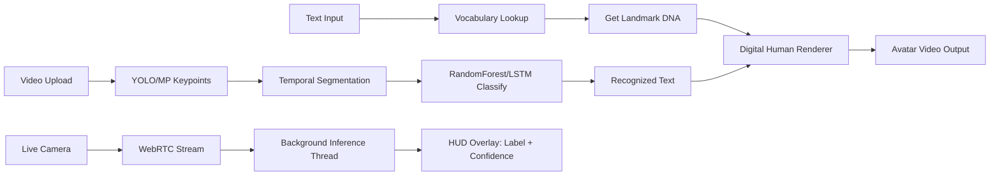

# Walkthrough: Wasel v4 Pro — Production Deployment

## ✅ Bugs Fixed (5 Critical Issues)

| # | Bug | File | Fix |
|---|---|---|---|
| 1 | `from google.cloud import storage` crashes without GCS lib | `gcp_utils.py` | Conditional import with `GCS_AVAILABLE` flag |
| 2 | `os.remove(video)` called **before** `st.video()` reads it | `app.py` | Read video bytes into memory first, then delete |
| 3 | Streamlit tries to open browser on Cloud Run | `Dockerfile` | Added `--server.headless=true` |
| 4 | HEALTHCHECK uses `curl` but `curl` not installed | `Dockerfile` | Added `curl` to `apt-get install` |
| 5 | No `.gitignore` — `__pycache__` and `.env` pushed to repo | root | Created `.gitignore` |

## 🔄 Complete Workflow (End-to-End)



## 📂 Final File Tree

```
wasel_v4_pro/
├── app.py                    # 210 lines — 3 tabs (Text→Video, Video→Text, Live)
├── requirements.txt          # 18 dependencies
├── Dockerfile                # Cloud Run ready (headless, dynamic $PORT)
├── .gitignore                # Excludes __pycache__, .env, *.pt, *.pkl
├── .env.example              # API keys template
├── packages.txt              # System deps for Streamlit Cloud
├── backend/
│   ├── __init__.py
│   ├── engine.py             # Core: YOLO→MP fallback, TF→sklearn fallback
│   ├── vocabulary.py         # 24-word dynamic vocabulary
│   ├── digital_human.py      # Skeletal avatar renderer
│   └── gcp_utils.py          # GCS sync + Cloud Logging (conditional)
├── streaming/
│   ├── __init__.py
│   └── webrtc_hub.py         # Non-blocking WebRTC processor
└── deployment/
    ├── cloudbuild.yaml       # CI/CD pipeline
    └── vertex_ai_config.yaml # Vertex AI endpoint
```

## 🚀 Deploy Command

```bash
gcloud run deploy wasel-v4-pro \
  --source . \
  --region europe-west1 \
  --memory 2Gi \
  --cpu 2 \
  --allow-unauthenticated
```
