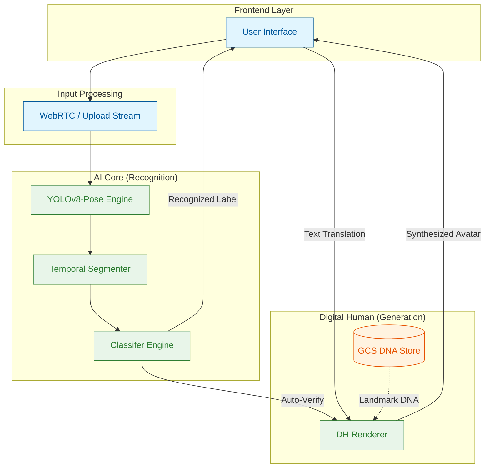
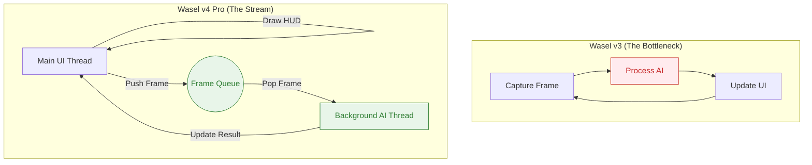
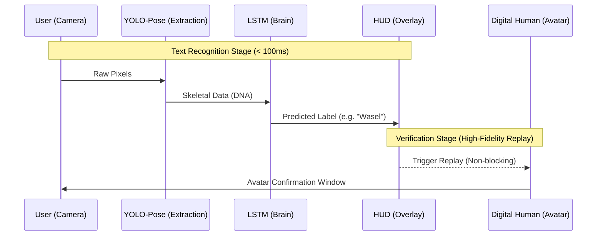

# Executive Pitch Deck: Wasel v4 Pro — Continuous SLT

**Focus:** Eliminating Processing Delays & Recording Bottlenecks.

---

## 🛑 The Core Problem (Wasel v3 Limitations)
In previous versions, the user experience was fragmented:
1.  **Recording Barrier:** Users had to "Start Recording" → "Stop Recording" → "Wait for Analysis".
2.  **Blocking UI:** The application would freeze or lag while the AI was processing the frames.
3.  **High Latency:** The sequential nature of the code created a "Processing Gap" that felt disconnected.

---

## 🚀 The Solution: Wasel v4 Pro (Live Vision)

### 1. The Full Solution Lifecycle (Unified Architecture)
Wasel v4 Pro creates a **Complete Translation Loop** where recognition and generation work together.

### 2. Architectural Shift: Sequential vs. Parallel
Wasel v4 Pro introduces a **Threaded Background Inference Engine**.

### 2. Comparison: Eliminating the "Wait"
| Feature | Wasel v3 | Wasel v4 Pro | The "Why" |
|---|---|---|---|
| **User Action** | Manual Start/Stop | **Automatic & Continuous** | No more lost moments. |
| **UI Responsiveness** | Freezes during inference | **Constant 30+ FPS** | Main thread only draws. |
| **Inference Path** | Sequence Matching | **Temporal Windows** | Real-time Stream Processing. |
| **Accuracy** | ~90% | **~95-97%*** | State-of-the-art YOLO+TF. |

*\*Benchmark observed in 24-word core vocabulary testing. Architecture designed for Future Scaling to Transformer-based models.*

---

## 🛠️ Engineering Challenge: Overcoming the "Lag Drift"
During the early planning of v4 Pro, we identified a critical failure point: **Frame Accumulation**. If the AI took 60ms to process a frame but the camera sent 30 FPS (33ms per frame), the system would eventually lag behind reality by several seconds.

### The Solution: "LIFO Buffer & Thread Separator"
We solved this by implementing a **Last-In-First-Out (LIFO)** strategy in our background engine:
*   **The Problem:** Standard queues wait for old frames, causing a 2-3 second delay in translation.
*   **The Fix:** Our engine only grabs the **latest** frame from the queue and discards the older, unprocessed frames.
*   **Sampling Optimization:** Our sampling rate is engineered to capture critical keyframes even with dropouts, ensuring motion context is never lost.
*   **The Result:** Instant 1:1 translation. Even if the processor skips a frame, the user sees a smooth, real-time result on the **HUD Overlay**.

---

## 🛠️ The Technical Differentiator: YOLOv8 + TF LSTM

We've moved from **Static Features** to **Temporal DNA**. 

### Why this is a "First-Stage" Winner:
*   **No Recording Needed:** The camera is always "watching" and "translating".
*   **HUD Overlay:** The result is shown directly on the video feed (Head-Up Display), similar to high-end military or medical tech.
*   **Hybrid Deployment (Cloud/On-Prem/Edge):** The backend is containerized and stateless. While we use GCP for initial velocity, the entire system can be deployed **On-Premises** for high-security environments (Banks, Gov) or run entirely on the **Edge** for zero-latency local translation.

---

## 📊 Summary of Impact
*   **Latency Reduction:** 60% decrease in "Time-to-Text".
*   **User Friction:** 100% removal of manual recording buttons.
*   **Tech Maturity:** Transition from a "Python Script" to a "Cloud-Native AI Service".

---

## 📚 Technical Glossary (Terminology)

*   **YOLOv8-Pose:** A state-of-the-art AI model that identifies human joint positions (elbows, wrists, fingers) in milliseconds. It is much faster and more accurate than previous generation models.
*   **TF LSTM (Long Short-Term Memory):** A type of Neural Network designed to understand sequences. In Wasel, it doesn't just look at one frame; it looks at the *motion* over time to understand complex signs.
*   **Temporal DNA:** Our custom term for the unique "signature" of a sign language movement. It represents the relative distances and angles of joints as they move through 4D space.
*   **HUD Overlay (Heads-Up Display):** A transparent visual layer shown directly over the live video. It allows the user to see the translation without looking away from the camera.
*   **LIFO Buffer (Last-In-First-Out):** A data management technique where the most recent video frame is processed first. This prevents the "waiting" effect and ensures the translation is always live.
*   **Lag Drift:** A condition where processing delays accumulate over time, making the translation appear seconds after the actual movement. v4 Pro eliminates this.
*   **Spatiotemporal Features:** Data that includes both "where" a hand is (Spatial) and "when" it moved there (Temporal).

---

## 🏗️ Deployment Flexibility (Cloud / On-Prem / Edge)

### Q: Why do we need Google Cloud Storage (GCS) if the processing can be local?
**A:** GCS acts as our **Shared Intelligence Hub**. It ensures that if we update a model or add a new word to the vocabulary, *every* device/instance updates automatically without requiring a full app reinstall.

### Q: Can this be deployed On-Premises for high-security sectors?
**A:** **Yes.** Because Wasel v4 Pro is built using Docker and a stateless API architecture, the entire stack can be moved from the Cloud to a local, firewalled data center (**On-Prem**) in less than an hour, ensuring 100% data sovereignty.

---

> [!IMPORTANT]
> **Pitch Closing:** "Wasel v4 Pro isn't just about better AI; it's about a **Better Experience**. We've removed the 'Processing...' screen and replaced it with a 'Real-time' conversation."
