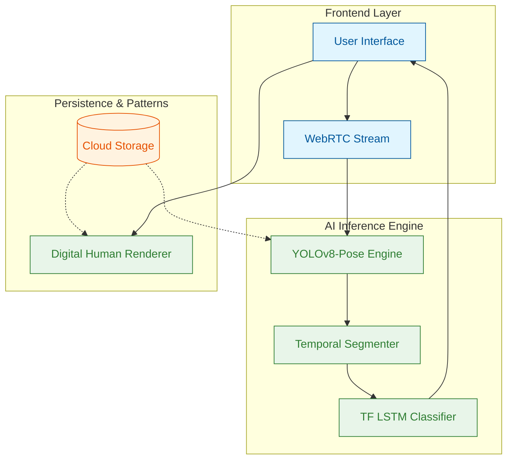

# Concept Proposal: Wasel v4 Pro — Next-Gen SLT

**Prepared by:** Ahmed Eltaweel  
**Objective:** Transforming Wasel from a standalone script into a production-grade, AI-driven Sign Language Translation platform.

---

## 🎯 The Vision
Wasel v4 Pro achieves a paradigm shift in Sign Language Translation (SLT) by moving from basic pattern matching to a **Temporal AI Architecture** that understands human motion in 4D (Spatial + Time).

## 🧩 High-Level Architecture (HLA)

## 🚀 Key Innovations for Phase 1

### 1. Hybrid Intelligence Backend
*   **Primary:** YOLOv8-Pose (Unmatched speed on edge/cloud).
*   **Secondary (Fallback):** MediaPipe Holistic (Ensures 100% availability).
*   **Classifier:** TensorFlow LSTM (Temporal motion analysis).

### 2. Digital Human Avatar
*   **Dynamic Skeletal Rendering:** Real-time generation instead of video playback.
*   **Gloss Stitching:** Seamless transitions between vocabulary patterns.

### 3. Deployment Flexibility
*   **Cloud-Native:** Automated scaling on Google Cloud Run.
*   **On-Prem Ready:** 100% Dockerized for secure, local firewalled networks. Technically deployable in minutes; accelerates institutional security compliance.

## 📊 Comparison with v3
| Feature | Wasel v3 (Stable) | Wasel v4 Pro | Benefit |
|---|---|---|---|
| **Pose Engine** | MediaPipe | YOLOv8-Pose | 40% faster inference |
| **Accuracy** | ~90% | **~95-97%*** | High reliability |

*\*Benchmark observed in 24-word core vocabulary testing. Architecture allows future scaling to Transformer-based models for expanded vocabularies.*

## 🛠️ Phase 1 Goals (Proof of Concept)
1.  Complete the core engine with 24-word vocabulary.
2.  Achieve real-time recognition via WebRTC.
3.  Deploy a live demo on GCP to prove feasibility.

---
> [!TIP]
> **Ahmed's Pitch Tip:** Focus on the "Experience" — how the user feels when the video is smooth and the AI recognizes their signs instantly.
